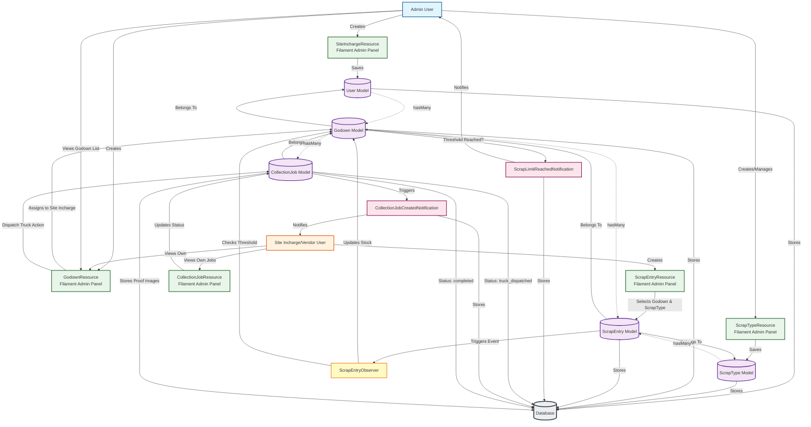

# Recycler Application - Data Flow Diagram

## Data Flow Summary

### 1. **User & Setup Flow**
- **Admin** creates **Site Incharge** users via `SiteInchargeResource`
- **Admin** manages **Scrap Types** (with unit prices) via `ScrapTypeResource`
- **Admin** or **Site Incharge** creates **Godowns** (sites) assigned to Site Incharge

### 2. **Scrap Entry Flow**
- **Site Incharge** creates **Scrap Entries** via `ScrapEntryResource`
- Each entry links to a **Godown** and **Scrap Type**
- `ScrapEntryObserver` automatically:
  - Updates **Godown** `current_stock_mt`
  - Checks if capacity threshold is reached
  - Sends `ScrapLimitReachedNotification` to **Admin** if threshold reached

### 3. **Collection Job Flow**
- **Admin** views **Godowns** and dispatches trucks via "Dispatch Truck" action
- Creates **CollectionJob** with status `truck_dispatched`
- Sends `CollectionJobCreatedNotification` to **Site Incharge**
- **Site Incharge** views and updates collection job:
  - Uploads collection proof image
  - Uploads challan image
  - Updates collected amount
  - Marks job as `completed`

### 4. **Key Relationships**
- **User** (Site Incharge) → hasMany → **Godown**
- **Godown** → hasMany → **ScrapEntry**
- **Godown** → hasMany → **CollectionJob**
- **ScrapType** → hasMany → **ScrapEntry**

### 5. **Notifications**
- **ScrapLimitReachedNotification**: Sent to Admin when godown reaches capacity
- **CollectionJobCreatedNotification**: Sent to Site Incharge when truck is dispatched
